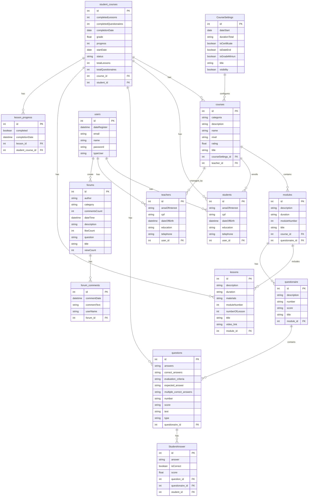

# 🦫 CapyCourses - A Jornada do Saber Começa Aqui! 📚

> Transformando o aprendizado em uma experiência extraordinária com tecnologia e inovação.

[](https://github.com/StephanyeCunto/CapyCourses/actions/workflows/ci-cd.yml)
[](https://www.oracle.com/java/)
[](https://openjfx.io/)
[](LICENSE)
[](https://wakatime.com/badge/user/5a343522-23db-45ae-b20b-54655c392390/project/777997fa-1d4e-4bf3-acd5-5b2f3fbbf946)
[](https://wakatime.com/badge/user/cfd3175d-aa54-44f0-b0c6-befacccd6793/project/b49cdaa5-fd26-4250-b17e-2c68c5875e52)

---

## 📋 Sumário

- [Sobre o Projeto](#-sobre-o-projeto)
- [Funcionalidades](#-funcionalidades)
- [Tecnologias](#-tecnologias)
- [Começando](#-começando)
- [Estrutura do Projeto](#-estrutura-do-projeto)
- [Metodologia](#-metodologia)
- [Interface](#-interface)
- [Contribuição](#-contribuição)
- [Roadmap](#-roadmap)
- [Licença](#-licença)
- [FAQ](#-faq)
- [Contribuições Futuras](#-contribuições-futuras)
- [Segurança](#-segurança)
- [Diagrama Entidade Relacionamento](#-diagrama-entidade-relacionamento)
- [Comunicação](#-comunicação)
- [PMD](#-alise-estatica-com-pmd)
- [JavaDoc](#-documentacao-com-javadoc)
- [SQLite](#-sqlite)
- [Feedback](#-feedback)
- [Roadmap Detalhado](#-roadmap-detalhado)
- [Licenciamento](#-licenciamento)
- [Agradecimentos](#-agradecimentos)
---

## 🎯 Sobre o Projeto

O **CapyCourses** é uma plataforma de ensino online desenvolvida em JavaFX, projetada para oferecer uma experiência de aprendizado moderna, intuitiva e envolvente. Nossa missão é democratizar o conhecimento através de uma interface amigável e recursos inovadores.

### 🦫 Por que CapyCourses?

| Característica          | Descrição                                                                 |
|-------------------------|---------------------------------------------------------------------------|
| 🎨 *Design Moderno*      | Interface elegante com suporte a temas claro/escuro.                      |
| 📱 *Responsividade*      | Adaptável a diferentes dispositivos e resoluções.                         |
| 🔒 *Segurança*           | Sistema robusto de autenticação e permissões.                             |
| 🚀 *Performance*         | Otimizado para máxima eficiência.                                         |
| 🌟 *Experiência*         | Foco na usabilidade e satisfação do usuário.                              |
| 🦫 *Comunidade*          | Ambiente colaborativo com fóruns e interação entre alunos e professores.  |

---

## ✨ Funcionalidades

### 🎓 Gerenciamento de Cursos
- Criação e edição de cursos.
- Organização por categorias e níveis de dificuldade.
- Sistema de avaliação e feedback.
- Acompanhamento de progresso do aluno.
- Emissão de certificados personalizados.

### 👥 Perfis de Usuário
- **Aluno**: Acesso a cursos, materiais e fóruns.
- **Professor**: Criação e gerenciamento de cursos.
- **Administrador**: Controle total da plataforma.

### 📚 Recursos de Aprendizado
- Biblioteca digital com materiais complementares.
- Fórum de discussão para interação entre alunos e professores.
- Vídeos, quizzes e materiais interativos.
- Certificados personalizados ao concluir cursos.

### ⚙️ Personalização
- Modo escuro/claro.
- Configurações de perfil personalizadas.
- Preferências salvas.
- Notificações personalizáveis.

### 🛠️ Ferramentas Avançadas
- Dashboard de desempenho com métricas detalhadas.
- Relatórios de progresso e desempenho.

---

## 🛠️ Tecnologias 

### Core

| Tecnologia | Versão | Descrição |
|:----------:|:------:|:---------:|
|  | 17+ | Backend e lógica principal |
|  | 19+ | Interface gráfica |
|  | 3.6+ | Gestão de dependências |

### Dependências

| Tecnologia | Versão | Descrição |
|:----------:|:------:|:---------:|
|  | 1.18+ | Redução de boilerplate |
|  | 2.0+ | Validação de formulários |
|  | 6.0+ | Persistência de dados |
|  | 5.0+ | Testes unitários |

---

### Ferramentas de Desenvolvimento
- **VS Code**: IDE principal.
- **Git**: Controle de versão.
- **Scene Builder**: Design de interfaces JavaFX.

---

## 🚀 Começando

### 💻 Requisitos

### Sistema
- **CPU**: Dual-core 2GHz ou superior
- **RAM**: 4GB mínimo (8GB recomendado)
- **Armazenamento**: 500MB de espaço livre
- **Rede**: Conexão de internet estável (2Mbps+)

### Software
- **Sistema Operacional**: Windows 10/11, macOS 12+, Ubuntu 20.04+
- **Java**: JDK 17 ou superior
- **JavaFX**: 19 ou superior
- **Maven**: 3.6 ou superior

### 🚀 Instalação

### Passo 1: Configuração do Ambiente

```bash
# Verifique a instalação do Java
java -version

# Verifique a instalação do Maven
mvn -version

# Clone o repositório
git clone https://github.com/StephanyeCunto/CapyCourses.git
cd CapyCourses
```

### Passo 2: Variáveis de Ambiente

```bash
# Linux/macOS
export JAVA_HOME=/path/to/java
export PATH=$JAVA_HOME/bin:$PATH

# Windows (PowerShell)
$env:JAVA_HOME = "C:\Program Files\Java\jdk-17"
$env:Path += ";$env:JAVA_HOME\bin"
```
### Passo 3: Execução

```bash
# Instale as dependências
mvn clean install

# Execute o projeto
mvn javafx:run
```

---
## 🔧 Integração Contínua (CI)

O projeto utiliza **GitHub Actions** para garantir a qualidade do código. A cada push ou pull request, o pipeline de CI é executado para:

- Compilar o projeto.
- Executar testes automatizados.
- Verificar a qualidade do código.

[](https://github.com/StephanyeCunto/CapyCourses/actions/workflows/ci-cd.yml)

### Como Funciona?
1. **Compilação**: O projeto é compilado usando o Maven (`mvn clean package`).
2. **Testes**: Os testes automatizados são executados (`mvn test`).
3. Análise Estática: O código é verificado com o PMD (`mvn pmd:check`).
4. Verificação de Dependências: As dependências são analisadas com OWASP Dependency-Check (`mvn org.owasp:dependency-check-maven:check`).
5. **Status**: O badge acima mostra o status atual do CI (✅ passando ou ❌ falhando).

### Como Verificar?
- Clique no badge **CI Status** para ver os detalhes da execução do pipeline na aba **Actions** do GitHub.

---

## 🗂️ Estrutura do Projeto
```bash
src/
├── com/
│   ├── login_cadastro/     # Autenticação
│   ├── paginaInicial/      # Páginas principais
│   ├── model/              # Entidades
│   └── controller/         # Controladores
├── resources/
│   ├── views/             # Arquivos FXML
│   ├── css/               # Estilos
│   └── images/            # Recursos visuais
```
## 📈 Metodologia

Utilizamos **Scrum** como framework ágil, com:

- 🔄 Sprints de 2 semanas
- 📊 Planejamento iterativo e priorização de tarefas.
- 👥 Daily meetings para acompanhamento do progresso.
- 📝 Retrospectivas para melhoria contínua.

### Padrões de Projeto

- 🏗️ **MVC (Model-View-Controller)**: Separação de responsabilidades entre modelos, visualizações e controladores.
- 🔒 **Singleton**: Garantia de que apenas uma instância de uma classe seja criada.
- 🗃️ **DAO (Data Access Object)**: Abstração de acesso a dados para persistência.
- 🧩 **Factory**: Criação de objetos de forma flexível e desacoplada.

### Ferramentas de Gestão

- **Trello**: Para gerenciamento de tarefas e acompanhamento de sprints.
- **GitHub Projects**: Para organização de issues e pull requests.
- **Discord**: Para comunicação diária e reuniões da equipe.

---

## 🖼️ Interface

### Tela de Login (Modo Escuro)


### Tela Inicial Aluno (Modo Claro)


*Mais screenshots disponíveis na [galeria completa](https://github.com/StephanyeCunto/CapyCourses/tree/main/img)*

---

## 👥 Contribuição

1. Fork o projeto.
2. Crie sua branch (`git checkout -b feature/AmazingFeature`).
3. Commit suas mudanças (`git commit -m 'Add: nova funcionalidade'`).
4. Push para a branch (`git push origin feature/AmazingFeature`).
5. Abra um Pull Request.

### Diretrizes de Contribuição

- 📝 **Documentação**: Mantenha a documentação atualizada.
- 🧪 **Testes**: Adicione testes unitários e de integração para novas funcionalidades.
- 🧹 **Clean Code**: Siga as boas práticas de codificação.
- 🔄 **Revisão**: Submeta seu código para revisão antes de merge.

### Boas Práticas

- Use nomes descritivos para branches, commits e variáveis.
- Documente novas funcionalidades no README ou em arquivos específicos.
- Respeite o padrão de código definido no projeto.

---

## 🗺 Roadmap

### Em Andamento
- [x] Interface responsiva.
- [ ] Integração com banco de dados.
- [ ] Sistema de permissões avançado.

### Próximas Etapas
- [ ] Módulo de análise de desempenho.
- [ ] API REST para integração com outras plataformas.
- [ ] Suporte a múltiplos idiomas.

### Futuro
- [ ] Integração com serviços de pagamento.
- [ ] Aplicativo móvel (Android/iOS).
- [ ] Inteligência Artificial para recomendações personalizadas.

---

## 📄 Licença

Distribuído sob a licença MIT. Veja `LICENSE` para mais informações.

---

## ❓ FAQ

### Perguntas Frequentes

#### 1. Como reportar um bug?
- Abra uma **issue** no GitHub com a descrição do problema.
- Inclua:
  - Passos para reproduzir o bug.
  - Capturas de tela ou vídeos, se aplicável.
  - Informações sobre o ambiente (SO, versão do Java, etc.).

#### 2. Como sugerir uma nova funcionalidade?
- Crie uma **issue** com a label `enhancement`.
- Descreva sua ideia de forma clara e detalhada.
- Explique como a funcionalidade beneficiaria os usuários.

#### 3. Como configurar o ambiente de desenvolvimento?
- Siga o guia na seção [Configuração do Ambiente](#-configuração-do-ambiente).
- Se encontrar problemas, consulte a [documentação oficial do JavaFX](https://openjfx.io/).

#### 4. Onde posso encontrar mais screenshots da interface?
- Acesse a [Galeria de Screenshots](#-galeria-de-screenshots) no README.
- Ou visite o diretório `img/` no repositório.

#### 5. Como contribuir para o projeto?
- Siga as diretrizes na seção [Contribuição](#-contribuição).
- Leia o [Código de Conduta](CODE_OF_CONDUCT.md) antes de começar.

#### 6. Onde posso obter suporte?
- Entre em contato conosco via:
  - **Discord**: [Link do servidor](#)
  - **E-mail**: support@capycourses.com

---

## 🔮 Contribuições Futuras

### Lista de Desejos
- [ ] Suporte a cursos offline.
- [ ] Integração com Google Classroom.
- [ ] Gamificação (badges e rankings).
- [ ] Suporte a múltiplos idiomas.

### Como Contribuir para Novas Funcionalidades
1. Verifique o [Roadmap](#-roadmap) para ver se a funcionalidade já está planejada.
2. Crie uma issue com a label `enhancement` para discutir a ideia.
3. Após aprovação, siga as diretrizes de contribuição.

---

## 🔒 Segurança

### Política de Segurança
- **Reporte Vulnerabilidades**: Envie um e-mail para security@capycourses.com.
- **Boas Práticas**:
  - Nunca compartilhe credenciais de acesso.
  - Use senhas fortes e autenticação de dois fatores (2FA).
  - Mantenha suas dependências atualizadas.

### Auditoria de Código
- Realizamos auditorias periódicas para garantir a segurança do código.
- Utilizamos ferramentas como [PMD](https://pmd.github.io) para análise estática.

---

## 📉 Diagrama Entidade Relacionamento



---

## 🔍 Análise Estática com PMD

O **PMD** é uma ferramenta de análise estática de código que ajuda a identificar problemas comuns, más práticas e potenciais vulnerabilidades no código-fonte. Ele é amplamente utilizado para garantir que o código siga boas práticas de desenvolvimento e mantenha um alto padrão de qualidade.

### Por que Usamos o PMD?
- **Identificação de Code Smells**: Detecta padrões de código que podem indicar más práticas ou complexidade desnecessária, como métodos muito longos, classes excessivamente grandes ou duplicação de código.
- **Prevenção de Bugs**: Identifica problemas antes que eles se tornem bugs em produção.
- **Padronização**: Garante que o código siga boas práticas e padrões consistentes.
- **Gratuito e Open-Source**: Totalmente gratuito e com suporte da comunidade.

### Como o PMD é Integrado ao CapyCourses?
O PMD é executado automaticamente em cada push ou pull request através do **GitHub Actions**. Ele verifica o código em busca de problemas e gera relatórios que são usados para corrigir e melhorar o código.

#### Configuração do PMD no Projeto
O PMD está configurado no arquivo `pom.xml` do projeto, utilizando o plugin Maven:

```xml
<plugin>
    <groupId>org.apache.maven.plugins</groupId>
    <artifactId>maven-pmd-plugin</artifactId>
    <version>3.20.0</version>
    <configuration>
        <rulesets>
            <ruleset>category/java/bestpractices.xml</ruleset>
            <ruleset>category/java/errorprone.xml</ruleset>
            <ruleset>category/java/design.xml</ruleset>
        </rulesets>
        <failOnViolation>false</failOnViolation>
    </configuration>
    <executions>
        <execution>
            <goals>
                <goal>check</goal>
            </goals>
        </execution>
    </executions>
</plugin>
```
#### Regras Utilizadas
- **Best Practices**: Verifica boas práticas de codificação.
- **Error Prone**: Detecta erros comuns que podem levar a bugs.
- **Design**: Identifica problemas de design, como classes com muitas responsabilidades.

#### Como Executar o PMD Localmente
Para executar o PMD localmente e verificar o código, use o seguinte comando Maven:

```bash
mvn pmd:check
```
Os relatórios serão gerados em `target/pmd.xml` e `target/pmd.html`.


### Benefícios do PMD para o CapyCourses
- **Melhoria da Qualidade do Código**: Identifica e corrige problemas antes que se tornem bugs.
- **Padronização**: Garante que o código siga boas práticas e padrões consistentes.
- **Prevenção de Vulnerabilidades**: Detecta potenciais problemas de segurança.

---

## 📚 Documentação com JavaDoc

O **JavaDoc** é uma ferramenta padrão para documentação de código Java que gera documentação HTML a partir de comentários no código-fonte. Esta ferramenta é fundamental para manter uma documentação clara, consistente e acessível do projeto.

### Por que Usamos o JavaDoc?
- **Documentação Padronizada**: Gera documentação em formato HTML consistente e profissional.
- **Integração com IDEs**: Suporte nativo em todas as principais IDEs Java.
- **Documentação Atualizada**: Mantém a documentação junto ao código, facilitando atualizações.
- **Ferramenta Oficial**: Parte do JDK, sendo o padrão da indústria para documentação Java.

### Como o JavaDoc é Integrado ao CapyCourses?
O JavaDoc é executado durante o processo de build através do Maven, gerando documentação completa e atualizada do projeto. A documentação é gerada automaticamente em cada release.

#### Configuração do JavaDoc no Projeto
O JavaDoc está configurado no arquivo `pom.xml` do projeto através do plugin Maven:

```xml
<plugin>
    <groupId>org.apache.maven.plugins</groupId>
    <artifactId>maven-javadoc-plugin</artifactId>
    <version>3.5.0</version>
    <executions>
        <execution>
            <goals>
                <goal>javadoc</goal>
            </goals>
        </execution>
    </executions>
</plugin>
```

#### Padrões de Documentação
1. **Documentação de Classes**:
```java
/**
 * Gerencia as operações relacionadas aos cursos na plataforma.
 * 
 * @author Equipe CapyCourses
 * @version 1.0
 * @since 1.0
 */
public class CourseManager {
    // implementação
}
```

2. **Documentação de Métodos**:
```java
/**
 * Cria um novo curso na plataforma.
 * 
 * @param course objeto contendo as informações do curso
 * @return o ID do curso criado
 * @throws IllegalArgumentException se os dados do curso forem inválidos
 * @throws DatabaseException se houver erro ao salvar no banco de dados
 */
public Long createCourse(Course course) {
    // implementação
}
```

#### Como Gerar Documentação
Para gerar a documentação localmente, use o seguinte comando Maven:

```bash
mvn javadoc:javadoc
```

A documentação será gerada em `target/site/apidocs/`.

### Benefícios do JavaDoc para o CapyCourses

1. **Para Desenvolvedores**:
   - Compreensão rápida do código
   - Documentação sempre atualizada
   - Suporte da IDE para visualização
   - Facilitação do processo de onboarding

2. **Para o Projeto**:
   - Documentação profissional
   - Manutenção simplificada
   - Redução de dúvidas técnicas
   - Melhoria da qualidade do código

3. **Para a Comunidade**:
   - Facilidade de contribuição
   - Documentação acessível
   - Curva de aprendizado reduzida

### Diretrizes de Documentação

1. **Elementos Obrigatórios**:
   - Descrição da classe/método
   - Parâmetros (@param)
   - Retorno (@return)
   - Exceções (@throws)
   - Autor (@author)
   - Versão (@version)

2. **Boas Práticas**:
   - Manter documentação atualizada
   - Usar linguagem clara e concisa
   - Incluir exemplos quando necessário
   - Documentar todos os métodos públicos
   - Mencionar comportamentos especiais

3. **Elementos Adicionais**:
   - @see para referências
   - @since para versionamento
   - @deprecated para métodos obsoletos
   - {@code} para trechos de código
   - {@link} para referências a outras classes

### Visualização da Documentação

A documentação gerada pode ser acessada de várias formas:
1. Localmente após geração (`target/site/apidocs/index.html`)
2. Através da IDE (hover sobre classes/métodos)

---

## 🗄️ SQLite

O **SQLite** é um sistema de gerenciamento de banco de dados relacional (RDBMS) que implementa um banco de dados SQL transacional, sem servidor e autocontido. Foi escolhido como a solução de banco de dados para o CapyCourses por suas características únicas e benefícios específicos para nossa aplicação.

### Por que Escolhemos SQLite?

#### Vantagens Principais
- **Sem Servidor**: Opera sem necessidade de um processo de servidor separado
- **Zero Configuração**: Não requer instalação ou configuração
- **Portabilidade**: Todo o banco de dados fica em um único arquivo
- **Confiabilidade**: Transações ACID compliant
- **Performance**: Excelente desempenho para aplicações desktop
- **Lightweight**: Biblioteca compacta (<600KB)

### Como o SQLite é Integrado ao CapyCourses?

#### Configuração no Projeto
O SQLite está configurado através das seguintes dependências no `pom.xml`:

```xml
<dependency>
    <groupId>org.xerial</groupId>
    <artifactId>sqlite-jdbc</artifactId>
    <version>3.36.0.3</version>
</dependency>
<dependency>
    <groupId>com.github.gwenn</groupId>
    <artifactId>sqlite-dialect</artifactId>
    <version>0.1.2</version>
</dependency>
```

#### Configuração do Hibernate
```xml
<property name="hibernate.dialect">org.hibernate.dialect.SQLiteDialect</property>
<property name="hibernate.connection.driver_class">org.sqlite.JDBC</property>
<property name="hibernate.connection.url">jdbc:sqlite:capycourses.db</property>
```

### Características Técnicas

#### 1. Tipos de Dados Suportados
- TEXT
- INTEGER
- REAL
- BLOB
- NULL

#### 2. Limitações e Considerações
- Sem suporte nativo a BOOLEAN (usa INTEGER 0/1)
- Sem tipos DATE/TIME nativos (armazenados como TEXT/INTEGER)
- Bloqueio a nível de arquivo durante escritas
- Limite de tamanho prático: 128TB

### Uso no CapyCourses

#### 1. Estrutura de Dados
```sql
-- Exemplo de tabela de cursos
CREATE TABLE courses (
    id INTEGER PRIMARY KEY AUTOINCREMENT,
    title TEXT NOT NULL,
    description TEXT,
    created_at TEXT DEFAULT CURRENT_TIMESTAMP,
    updated_at TEXT DEFAULT CURRENT_TIMESTAMP
);
```

#### 2. Boas Práticas Implementadas

1. **Backups Automáticos**:
```java
public void backupDatabase() {
    String dbPath = "capycourses.db";
    String backupPath = "backup_" + System.currentTimeMillis() + ".db";
    Files.copy(Paths.get(dbPath), Paths.get(backupPath));
}
```

2. **Otimização de Performance**:
```java
// Uso de transações para operações em lote
public void batchInsert(List<Course> courses) {
    try (Connection conn = getConnection()) {
        conn.setAutoCommit(false);
        // ... operações em lote
        conn.commit();
    }
}
```

### Benefícios para o CapyCourses

1. **Para Usuários**:
   - Instalação simplificada
   - Operação offline
   - Rápida inicialização
   - Backups simples

2. **Para Desenvolvedores**:
   - Ambiente de desenvolvimento simples
   - Debugging facilitado
   - Testes unitários simplificados
   - Controle de versão do banco

3. **Para o Projeto**:
   - Distribuição simplificada
   - Menor complexidade de infraestrutura
   - Custos reduzidos
   - Manutenção simplificada

### Práticas de Segurança

1. **Proteção do Arquivo**:
```java
private void secureDatabase() {
    File dbFile = new File("capycourses.db");
    // Define permissões restritas
    dbFile.setReadable(true, true);
    dbFile.setWritable(true, true);
}
```

2. **Prevenção de SQL Injection**:
```java
// Uso de PreparedStatement
public Course getCourse(int id) {
    String sql = "SELECT * FROM courses WHERE id = ?";
    try (PreparedStatement pstmt = conn.prepareStatement(sql)) {
        pstmt.setInt(1, id);
        // ... execução segura
    }
}
```

### Ferramentas de Desenvolvimento

1. **DB Browser for SQLite**:
   - Visualização e edição de dados
   - Execução de queries
   - Análise de estrutura

2. **SQLite Expert**:
   - Administração avançada
   - Otimização de performance
   - Análise de índices

### Monitoramento e Manutenção

1. **Verificação de Integridade**:
```java
public boolean checkDatabaseIntegrity() {
    try (Statement stmt = conn.createStatement()) {
        ResultSet rs = stmt.executeQuery("PRAGMA integrity_check;");
        return "ok".equalsIgnoreCase(rs.getString(1));
    }
}
```

2. **Otimização Regular**:
```java
public void optimizeDatabase() {
    try (Statement stmt = conn.createStatement()) {
        stmt.execute("VACUUM;");
        stmt.execute("ANALYZE;");
    }
}
```

### Migração e Versionamento

1. **Sistema de Migrations**:
   - Controle de versão do schema
   - Atualizações incrementais
   - Rollback seguro

2. **Exemplo de Migration**:
```java
@Migration(version = "1.0")
public void createInitialSchema() {
    executeSQL("CREATE TABLE IF NOT EXISTS courses (...);");
    executeSQL("CREATE INDEX idx_courses_title ON courses(title);");
}
```

---

## 📢 Comunicação

### Canais de Comunicação
- **Discord**: [Link do servidor](#)
  - Canais disponíveis:
    - `#geral`: Discussões gerais.
    - `#suporte`: Ajuda com problemas técnicos.
    - `#sugestões`: Ideias para novas funcionalidades.
- **Fórum**: [Link do fórum](#)
  - Discussões técnicas e compartilhamento de conhecimento.

### Reuniões da Comunidade
- **Quando**: Toda quarta-feira às 20h (GMT-3).
- **Onde**: Canal `#reuniões` no Discord.
- **Agenda**:
  - Apresentação de novas funcionalidades.
  - Discussão de issues abertas.
  - Planejamento de sprints.

---

## 📝 Feedback

### Formulário de Feedback
- [Link do formulário](#)
  - Nos ajude a melhorar! Deixe seu feedback sobre:
    - Usabilidade.
    - Funcionalidades.
    - Problemas encontrados.

### Agradecimentos
- Seu feedback é valioso para nós! Contribuidores que forneceram feedback significativo serão reconhecidos na seção [Agradecimentos](#-agradecimentos).

---

## 🗺 Roadmap Detalhado

### Cronograma
| Etapa                  | Status       | Prazo Estimado |
|------------------------|--------------|----------------|
| Interface responsiva   | Concluído    | Out/2023       |
| Integração com banco   | Em andamento | Dez/2023       |
| Sistema de permissões  | Planejado    | Jan/2024       |
| API REST               | Planejado    | Mar/2024       |

### Prioridades
1. Finalizar integração com banco de dados.
2. Implementar sistema de permissões avançado.
3. Desenvolver módulo de análise de desempenho.

---

## 📜 Licenciamento

### Licenças de Dependências
| Dependência       | Licença       |
|-------------------|---------------|
| JavaFX            | GPL v2        |
| Lombok            | MIT           |
| Hibernate         | LGPL          |
| JUnit 5           | EPL 2.0       |

### Política de Uso
- O projeto é distribuído sob a licença MIT.
- Você pode usar, modificar e distribuir o código, desde que inclua a licença original.

---

## 🙏 Agradecimentos

### Contribuidores
- [Stephanye Cunto](https://github.com/StephanyeCunto)
- [Julio Bossigia](https://github.com/juliobossigia)

### Reconhecimentos Especiais
- Agradecemos a todos que contribuíram com feedback, código e ideias para o projeto.

---

<p align="center">
  <strong>CapyCourses</strong> - Desenvolvido com 🧡 pela equipe CapyCourses<br>
  <sub>Transformando a educação, uma capivara de cada vez 🦫</sub>
</p>
