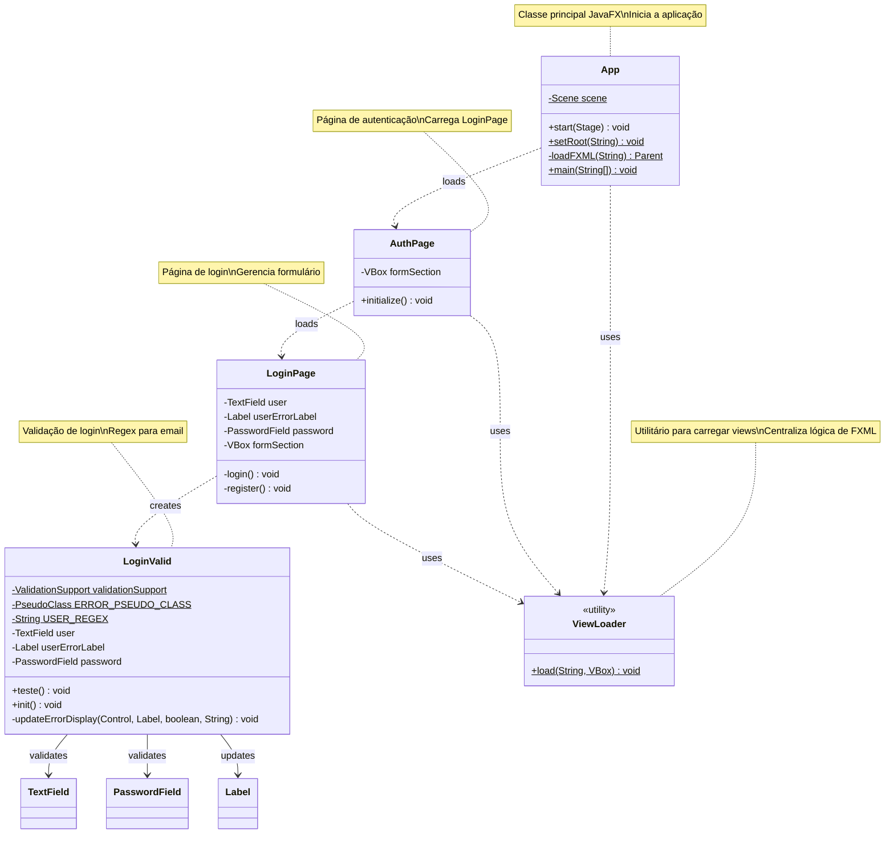

# CapyCourse

Sistema de autenticação desenvolvido em JavaFX com validação de formulários.

## 📋 Descrição

CapyCourse é uma aplicação desktop JavaFX que implementa um sistema completo de autenticação com interface gráfica moderna e validação de dados em tempo real.

## 🏗️ Arquitetura

### Diagrama de Classes



### Componentes Principais

#### 🚀 App
Classe principal da aplicação JavaFX responsável por:
- Inicializar a aplicação
- Gerenciar a cena principal (1000x600px)
- Carregar views FXML dinamicamente

#### 🔐 AuthPage
Página container de autenticação que:
- Carrega inicialmente a página de login
- Gerencia a seção de formulários

#### 📝 LoginPage
Gerencia a interface de login com:
- Campo de usuário (email)
- Campo de senha
- Botão de login com validação
- Opção para navegar para registro

#### ✅ LoginValid
Sistema de validação do formulário:
- Validação de email em tempo real usando regex
- Feedback visual de erros (pseudo-classes CSS)
- Exibição de mensagens de erro
- Padrão de email: `^[A-Za-z]+[A-Za-z0-9+_.-]*@[A-Za-z0-9.-]+\\.[A-Za-z]{2,}$`

#### 🔧 ViewLoader
Classe utilitária para:
- Carregar views FXML de forma centralizada
- Substituir conteúdo de containers VBox
- Simplificar navegação entre telas

## 🛠️ Tecnologias

- **Java** - Linguagem principal
- **JavaFX** - Framework de interface gráfica
- **FXML** - Declaração de interfaces
- **Lombok** - Redução de boilerplate
- **ControlsFX** - Componentes avançados de validação

## 📦 Estrutura de Pacotes

```
com.singleton
├── App.java
com.view.auth
├── AuthPage.java
├── LoginPage.java
└── valid
    └── LoginValid.java
com.view.utility
└── ViewLoader.java
```

## 🚀 Como Executar

1. Certifique-se de ter o Java 11+ instalado
2. Configure as dependências do JavaFX
3. Execute a classe `App.java`

```bash
java --module-path /path/to/javafx-sdk/lib --add-modules javafx.controls,javafx.fxml -jar capycourse.jar
```

## 📋 Funcionalidades

- ✅ Validação de email em tempo real
- ✅ Feedback visual de erros
- ✅ Navegação entre telas (Login/Registro)
- ✅ Arquitetura modular e escalável
- ✅ Separação de responsabilidades (MVC)

## 🎯 Próximos Passos

- [ ] Implementar página de registro completa
- [ ] Adicionar validação de senha
- [ ] Integrar com backend/banco de dados
- [ ] Implementar autenticação JWT
- [ ] Adicionar testes unitários

## 📝 Licença

Este projeto está sob licença a definir.

## 👥 Contribuidores

Desenvolvido com ❤️ pela equipe CapyCourse